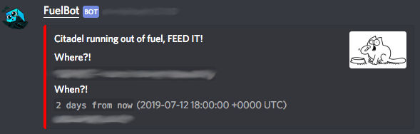
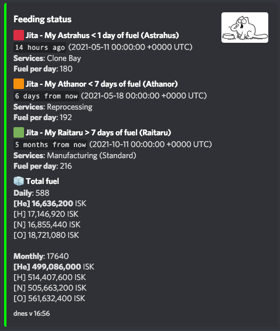
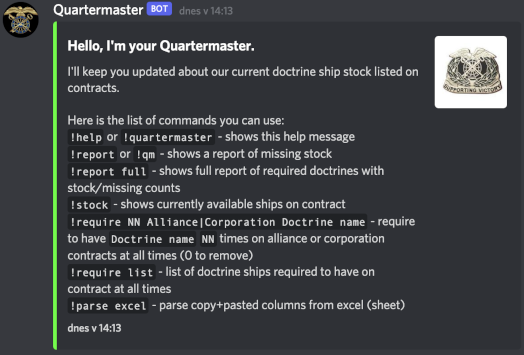
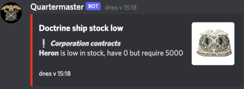
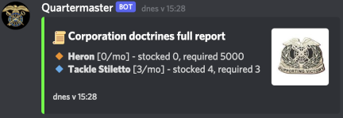

Given my passion for Sci-Fi and all things related to space, it's only natural that **EVE Online** has captured my heart.

What is EVE Online?
> Eve Online is a massively multiplayer online game (MMO) set in a science fiction universe, known for its complex player-driven economy and expansive sandbox gameplay. In the game, players pilot customizable spacecraft across a vast universe, engaging in various activities such as exploration, mining, trading, combat, and diplomacy. The game offers a highly immersive experience with a rich backstory, player-driven events, and a dynamic political landscape shaped by the actions of individual players and player-run corporations. Eve Online is renowned for its depth, complexity, and emergent gameplay possibilities.

The game offers pretty rich set of APIs which you can use to build tools for your community. The availability of the APIs, together with me having to write tools for everything I can, gave rise to few Discord bots to help my community:
- [EVE FuelBot](https://github.com/lunemec/eve-fuelbot)
- [EVE Quartermaster](https://github.com/lunemec/eve-quartermaster)
- [EVE Accountant](https://github.com/lunemec/eve-accountant)

Each of these bots does its own thing, and if you don't know details of EVE Online gameplay, they won't make much sense to you. For those curious, you can read more in each of the bots READMEs.

  
  
  
  

